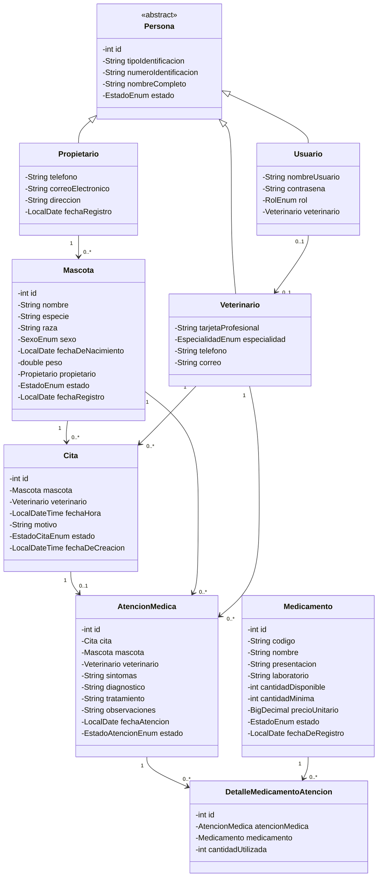
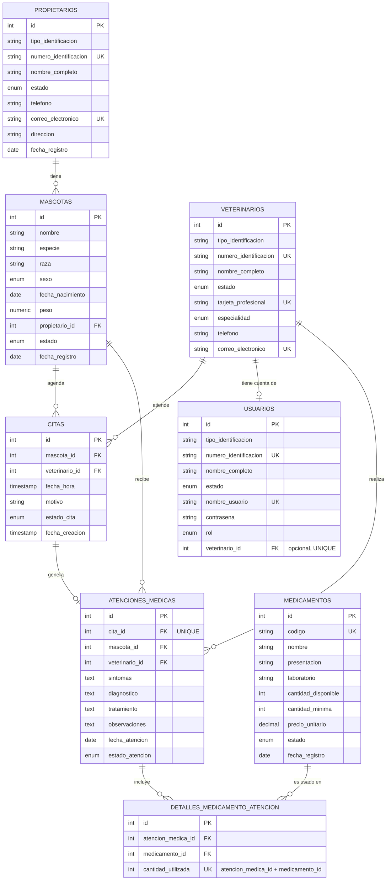

# VetCare – Sistema de Gestión para una Clínica Veterinaria

Aplicación de escritorio en **Java SE** con interfaz mediante **JOptionPane**, persistencia con **JDBC** sobre **PostgreSQL**, y arquitectura organizada en capas (Model, Repository, Service, Controller, Presentation).

---

## Descripción

VetCare centraliza la información de propietarios, mascotas, veterinarios, citas, atenciones médicas y medicamentos de una clínica veterinaria, reemplazando el manejo manual mediante agendas físicas y hojas de cálculo.

El sistema permite:

- Registrar y consultar propietarios, mascotas y veterinarios.
- Programar citas validando disponibilidad de mascota y veterinario.
- Registrar atenciones médicas (síntomas, diagnóstico, tratamiento) asociadas a una cita confirmada.
- Controlar el inventario de medicamentos, descontando existencias al finalizar una atención mediante una **transacción**.
- Consultar el historial médico completo de una mascota.
- Gestionar usuarios con autenticación y control de acceso por rol (ADMIN, RECEPCIONISTA, VETERINARIO).

---

## 🛠️ Tecnologías

| Tecnología | Uso |
|---|---|
| Java 17+ | Lenguaje principal |
| JOptionPane (Swing) | Interfaz gráfica de usuario |
| JDBC | Persistencia de datos |
| PostgreSQL 16 | Motor de base de datos |
| Docker / Docker Compose | Entorno de base de datos |
| Maven | Gestión de dependencias y build |
| Git / GitHub | Control de versiones |

---

## 🏛️ Arquitectura del proyecto

El proyecto sigue una arquitectura por capas, separando presentación, lógica de negocio y persistencia:

```
Presentation (JOptionPane)
        │
   Controller
        │
    Service   ← reglas de negocio, validaciones, excepciones, transacciones
        │
  Repository  ← interfaces (contratos) + implementaciones JDBC
        │
     Model    ← entidades del dominio
```

- **Model**: clases del dominio (`Propietario`, `Mascota`, `Veterinario`, `Cita`, `Medicamento`, `Usuario`, `AtencionMedica`, `DetalleMedicamentoAtencion`), con herencia (`Persona` como clase abstracta) y enums de dominio.
- **Repository**: interfaces como contratos (`CrudRepository<T, ID>` genérico + interfaces específicas) e implementaciones JDBC con `PreparedStatement` y manejo de transacciones.
- **Service**: reglas de negocio, validaciones, excepciones personalizadas y la transacción de finalización de atención médica.
- **Controller**: capa delgada que conecta la presentación con los servicios.
- **Presentation**: menús de JOptionPane, diferenciados según el rol del usuario autenticado.
- **Exception**: excepciones personalizadas para errores de negocio (`BusinessException` y sus subclases) y de persistencia (`PersistenciaException`).
- **Config**: manejo de la conexión JDBC (`ConexionBD`), sin mantener una única conexión global abierta.

---

## 📁 Estructura de paquetes

```
src/main/java/com/vetcare/vetcare/
├── model/
│   └── enums/
├── repository/
│   └── impl/
├── service/
│   └── impl/
├── controller/
├── exception/
├── config/
├── view/
└── VetCare.java (clase principal / Main)
```

---

## Diagrama de clases

> _Plantilla: agrega aquí la imagen o el diagrama Mermaid de clases (`classDiagram`) según tu modelo final._



---

## Diagrama entidad-relación



---

## 🗄️ Base de datos

### Levantar PostgreSQL con Docker Compose

El proyecto incluye un `docker-compose.yml` que levanta una instancia de PostgreSQL 16 y ejecuta automáticamente el script de creación de tablas ubicado en `db-init/`.

```yaml
services:
  postgres-db:
    image: postgres:16
    container_name: vetcare_postgres
    restart: unless-stopped
    environment:
      POSTGRES_USER: postgres
      POSTGRES_PASSWORD: postgres_123
      POSTGRES_DB: vetcare
    ports:
      - "5432:5432"
    volumes:
      - postgres_data:/var/lib/postgresql/data
      - ./db-init:/docker-entrypoint-initdb.d
volumes:
  postgres_data:
```

**Pasos para levantar la base de datos:**

```bash
# Ubicarse en la raíz del proyecto (donde está docker-compose.yml)
docker compose up -d

# Si necesitas reiniciar la base de datos desde cero (vuelve a correr el script de db-init/)
docker compose down -v
docker compose up -d
```

La base de datos queda disponible en `localhost:5432`, base de datos `vetcare`, usuario `postgres`, contraseña `postgres_123` (ajustar en `ConexionBD.java` si se modifican estos valores).

### Script de creación de tablas

Ubicado en `db-init/init.sql` (o el nombre que le hayas dado). Incluye:

- 6 tipos `ENUM` nativos de PostgreSQL (`estado_enum`, `estado_atencion_enum`, `especialidad_enum`, `rol_enum`, `sexo_enum`, `estado_cita_enum`).
- 8 tablas con claves primarias, foráneas, restricciones `UNIQUE` (simples y compuestas) y `CHECK`.

> _Nota técnica: al comparar una columna de tipo ENUM en un `WHERE` o al insertarla junto a otras columnas ENUM en la misma sentencia, PostgreSQL puede requerir un cast explícito (`?::nombre_del_enum`) en el `PreparedStatement`._

---

## Configuración y ejecución

1. Clonar el repositorio.
2. Levantar la base de datos con Docker Compose (ver sección anterior).
3. Verificar los datos de conexión en `src/main/java/com/vetcare/vetcare/config/ConexionBD.java`.
4. Compilar el proyecto con Maven.
5. Ejecutar la clase principal (`VetCare.java` / `Main.java`).
6. Iniciar sesión con un usuario existente. Si es la primera ejecución, crear un usuario ADMIN directamente en la base de datos:

```sql
INSERT INTO usuarios (tipo_identificacion, numero_identificacion, nombre_completo, estado,
                       nombre_usuario, contrasena, rol, veterinario_id)
VALUES ('CC', '0000000001', 'Administrador Sistema', 'ACTIVO',
        'admin', 'admin123', 'ADMIN', NULL);
```

---

## ✨ Funcionalidades implementadas

- [x] CRUD de propietarios, mascotas, veterinarios y medicamentos.
- [x] Programación de citas con validación de disponibilidad (mascota y veterinario).
- [x] Inicio y finalización de atención médica.
- [x] Descuento de inventario y actualización de estado de cita mediante **transacción** (commit/rollback manual).
- [x] Consulta de historial médico por mascota.
- [x] Autenticación de usuarios con roles (ADMIN, RECEPCIONISTA, VETERINARIO) y menús diferenciados por rol.
- [x] Excepciones personalizadas para errores de negocio, separadas de los errores técnicos de persistencia.
- [x] Interfaces como contratos entre la capa de Service y la capa de persistencia (JDBC).

---

## Excepciones personalizadas

Jerarquía basada en `RuntimeException`:

- `BusinessException` (superclase común) → `OwnerNotFoundException`, `DuplicateOwnerDocumentException`, `InactiveOwnerException`, `PetNotFoundException`, `DuplicateVeterinarianLicenseException`, `VeterinarianNotAvailableException`, `AppointmentConflictException`, `InvalidAppointmentStateException`, `MedicineNotFoundException`, `InsufficientStockException`, `MedicalRecordAlreadyExistsException`, `UnauthorizedActionException`, `ErrorSistemaException`.
- `PersistenciaException` (checked) → errores técnicos de JDBC, capturados y traducidos en la capa de Service antes de llegar a la presentación.

---

## 👨‍💻 Author

- GitHub: **[Danilo-Doria](https://github.com/Danilo-Doria)**
- LinkedIn: **[Danilo Doria Diaz](https://www.linkedin.com/in/danilodd)**
- Mail: **danilodoria519@gmail.com**

## 📄 License

This project is licensed under the MIT License. Consult [LICENSE](/LICENSE) for more details.